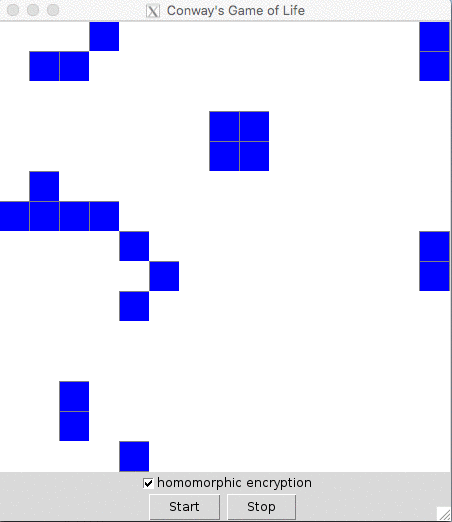

# GameOfLifeMeetsPySEAL

This is a implementation of Cornway's Game of Life in python using homomorphic encryption with the PySEAL library (https://github.com/Lab41/PySEAL). PySEAL is a python wrapper of the Simple Encrypted Arithmetic Library (SEAL) developed by Microsoft. The scope of this project includes a GUI using tkinter in python and a (simulated) server that is performing the computational operations.

## Dependencies

### Docker
In order to build the python wrapper of the C++ library it needs to be dockerized. Hence, docker needs to be installed.
Docker can be found here: https://docs.docker.com/install/

### XQuartz (Just needed for MacOS)
To run GUI applications using Docker for Mac, it is neccessary to install XQuartz and later execute the start commands in the XQuartz terminal. The installation guide can be found here: https://www.xquartz.org/ 

(For Ubuntu this is not necessary)

## Install
* Clone repository

## Run the Application
There are shell scripts that are used to run the application. Execute these to run the application:
1. Execute the `build.sh` script to build the image from the Dockerfile.  This also builds the Python wrapper for the SEAL.
2.  Execute the`run.sh` script to run a container derived from the previously built image
   and allow the GUI to connect to the host’s display.  This script consists of two parts
   as different solutions were needed for macOS and Ubuntu 18.04.
3. (optionally) Execute the `debug.sh` script to copy the log files of the server and the
   client from the container to the host. This can be used for debugging. 
